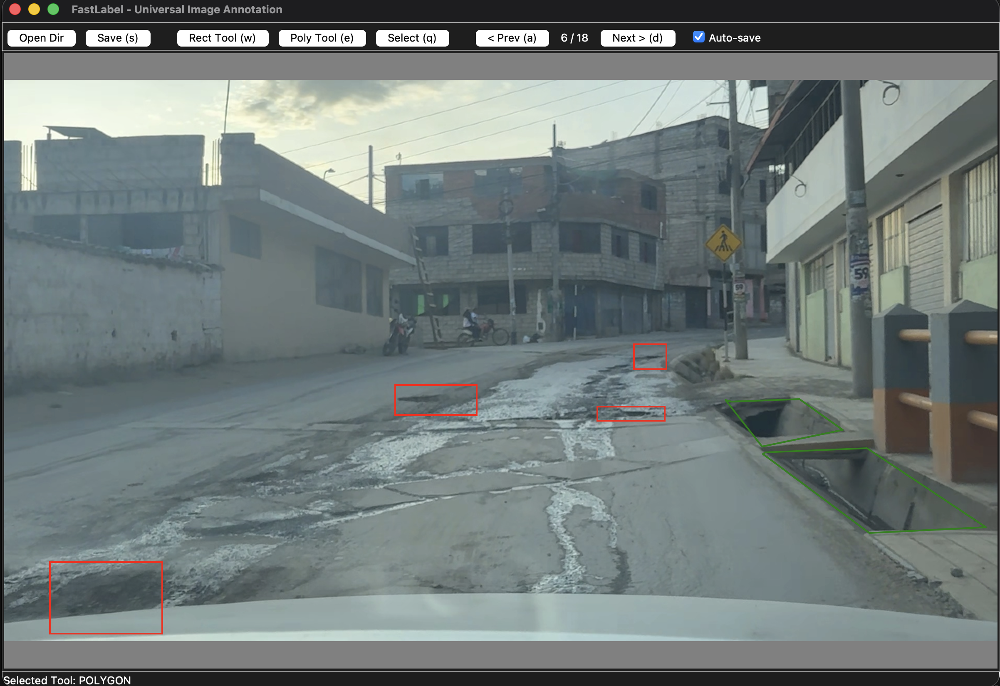

# FastLabel: Universal Image Annotation Tool / Herramienta Universal de Etiquetado

**FastLabel** is a lightweight, cross-platform Python application for labeling images with **Bounding Boxes** (Detection) and **Polygons** (Segmentation).  
*Es una aplicación ligera y multiplataforma en Python para etiquetar imágenes con **Cajas Delimitadoras** (Detección) y **Polígonos** (Segmentación).*
<p align="center">
  
</p>

Designed to create datasets for training AI models like YOLO (v5, v8, v11).  
*Diseñada para crear datasets para entrenar modelos de IA como YOLO (v5, v8, v11).*

---

## 🌍 Use Cases / Casos de Uso
While built originally for **pothole detection**, this tool is perfect for:  
*Aunque se creó originalmente para la **detección de baches**, esta herramienta es perfecta para:*

*   **Defect Detection**: Cracks, rust, scratches. (*Detección de Defectos: Grietas, óxido, rasguños.*)
*   **Object Detection**: Cars, pedestrians, animals. (*Detección de Objetos: Coches, peatones, animales.*)
*   **Medical Imaging**: Tumors, cell segmentation. (*Imágenes Médicas: Tumores, segmentación celular.*)
*   **Agriculture**: Crop monitoring, disease identification. (*Agricultura: Monitoreo de cultivos, identificación de enfermedades.*)

---

## 🚀 Features / Características
*   **Dual Mode**: Bounding Box (Rect) & Polygon. (*Modo Dual: Caja y Polígono.*)
*   **YOLO Format**: Normalized `.txt` output. (*Formato YOLO: Salida normalizada .txt.*)
*   **Auto-Save**: Saves automatically when navigating. (*Auto-Guardado: Guarda al navegar.*)
*   **Negative Samples**: Saves empty files for images with no objects. (*Muestras Negativas: Guarda archivos vacíos para imágenes sin objetos.*)
*   **Cross-Platform**: Windows, macOS, Linux.

---

## 📦 Installation / Instalación

### Prerequisites / Requisitos
*   **Python 3.8+** ([Download / Descargar](https://www.python.org/downloads/))

### 1. Set up / Configuración

#### **Windows**
```powershell
# 1. Navigate to folder / Navegar a la carpeta
cd path\to\sofware-labels

# 2. Create virtual environment / Crear entorno virtual
python -m venv venv

# 3. Activate / Activar
.\venv\Scripts\activate

# 4. Install dependencies / Instalar dependencias
pip install -r requirements.txt
```

#### **macOS / Linux**
```bash
# 1. Navigate to folder / Navegar a la carpeta
cd /path/to/sofware-labels

# 2. Create virtual environment / Crear entorno virtual
python3 -m venv venv

# 3. Activate / Activar
source venv/bin/activate

# 4. Install dependencies / Instalar dependencias
pip install -r requirements.txt
```

---

## 🎮 How to Run / Cómo Ejecutar

Ensure your environment is active `(venv)`. / *Asegúrate de que tu entorno esté activo `(venv)`.*

```bash
python main.py
```

---

## 📖 User Guide / Guía de Usuario

1.  **Open Dir**: Select folder with images. (*Seleccionar carpeta con imágenes.*)
2.  **Select Tool / Seleccionar Herramienta**:
    *   **`W`** / **Rect Tool**: Bounding Boxes (Cajas).
    *   **`E`** / **Poly Tool**: Polygons (Polígonos).
    *   **`Q`** / **Select Tool**: Select shapes to delete. (*Seleccionar formas para borrar.*)
3.  **Draw / Dibujar**:
    *   **Box**: Click & Drag. (*Clic y Arrastrar.*)
    *   **Polygon**: Click points. **Right-click** to close. (*Clic puntos. **Clic derecho** para cerrar.*)
    *   **Select**: Click a shape to highlight it magenta. Press **Delete** to remove. (*Clic en una forma para resaltar. Presiona **Suprimir** para borrar.*)
4.  **Navigate / Navegar**:
    *   **`D`** (Next/Siguiente), **`A`** (Prev/Anterior).
    *   **Auto-save** is on by default. (*Auto-guardado activo por defecto.*)

### Shortcuts / Atajos
| Key | Action | Acción |
| :--- | :--- | :--- |
| **W** | Rect Tool | Herramienta Rectángulo |
| **E** | Poly Tool | Herramienta Polígono |
| **Q** | Select Tool | Herramienta Seleccionar |
| **D** | Next Image | Siguiente Imagen |
| **A** | Prev Image | Imagen Anterior |
| **S** | Force Save | Forzar Guardado |
| **Z** | Undo | Deshacer |
| **Delete** | Delete Selected | Borrar Seleccionado |

---

## 📄 Output Format / Formato de Salida
Files are saved as `.txt` in the image folder. / *Los archivos se guardan como .txt en la carpeta de imágenes.*

**Bounding Box / Caja**:
```
<class_id> <x_center> <y_center> <width> <height>
```

**Polygon / Polígono**:
```
<class_id> <x1> <y1> <x2> <y2> ... <xn> <yn>
```
